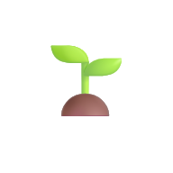

# Garden Multi-Sensor Humidity Monitoring System

A complete solution for monitoring soil humidity in your garden using ESP32 microcontrollers with **multiple sensors per device** and a Python web server with a responsive dashboard.



## Overview

This project allows you to monitor soil moisture levels in your garden using multiple capacitive soil moisture sensors connected to ESP32 microcontrollers. Each ESP32 can support multiple sensors (up to 3 by default), and the data is sent to a central server which stores the readings in a SQLite database and provides a web-based dashboard for visualization.

### Features

- **Multi-Sensor ESP32 Nodes**: Each ESP32 can handle multiple humidity sensors (configurable)
- **Individual Sensor Tracking**: Each sensor is identified by name and GPIO pin
- **Real-time Monitoring**: Continuous data collection with customizable intervals
- **Data Storage**: SQLite database for storing historical humidity readings with sensor identification
- **Advanced Web Dashboard**: Responsive web interface with multi-sensor visualization
- **Sensor Filtering**: Filter data by device and/or individual sensors
- **Multi-Sensor Charts**: Display multiple sensors on the same chart with different colors
- **PWA Support**: The dashboard can be installed as a Progressive Web App on mobile devices
- **Backward Compatibility**: Supports both single and multi-sensor configurations
- **Data Visualization**: Interactive charts showing humidity trends for individual or multiple sensors
- **Automatic Cleanup**: Old data is automatically purged to manage database size

## System Architecture

```
┌─────────────────┐      HTTP      ┌──────────────┐      HTTP      ┌─────────────┐
│  ESP32 with     │ ───────────────▶ Python Flask ◀────────────── │ Web Browser │
│ Multiple Sensors│  JSON Payload  │    Server    │  JSON/HTML     │  Dashboard  │
│ (3 sensors max) │                 │              │                │             │
└─────────────────┘                └──────────────┘                └─────────────┘
                                          │
                                          │ SQLite
                                          ▼
                                    ┌──────────────┐
                                    │  humidity.db │
                                    │ (with sensor │
                                    │ identification)│
                                    └──────────────┘
```

## Hardware Requirements

- ESP32 development board
- Multiple capacitive soil moisture sensors (up to 3 per ESP32 by default)
- Power supply for ESP32 (battery or wired)
- Server/computer to run the Python application (e.g., Raspberry Pi)

## Multi-Sensor Configuration

### Default Sensor Setup

The system is pre-configured for 3 sensors per ESP32:
- **Sensor 1**: GPIO 32 (Garden_1)
- **Sensor 2**: GPIO 33 (Garden_2)  
- **Sensor 3**: GPIO 34 (Garden_3)

### Customizable Configuration

All sensor settings are configurable in `config.h`:
```cpp
#define NUM_SENSORS 3
#define HUMIDITY_PINS {32, 33, 34}
#define SENSOR_NAMES {"Garden_1", "Garden_2", "Garden_3"}
```

## Software Components

### ESP32 Firmware (esp32.ino)

The ESP32 firmware reads analog values from multiple soil moisture sensors, converts them to humidity percentages, and sends the data to the server via HTTP POST requests. Each sensor is identified by name and GPIO pin.

Key features:
- **Multi-sensor support**: Configurable number of sensors (default: 3)
- **Individual sensor identification**: Each sensor has a unique name and pin
- **Averaging**: Data is averaged before transmission to reduce noise
- **Concurrent readings**: All sensors are read in each cycle
- **Enhanced logging**: Clear identification of which sensor generated each reading

### Python Server (server.py)

A Flask-based web server that:
- Receives data from ESP32 devices with multi-sensor support
- Stores readings in a SQLite database with sensor identification
- Provides API endpoints for retrieving humidity data with sensor filtering
- Serves the enhanced web dashboard with multi-sensor visualization
- Performs automatic data cleanup
- Supports backward compatibility with single-sensor setups

### Web Dashboard

A responsive web interface that provides:
- **Multi-sensor visualization**: View data from multiple sensors simultaneously
- **Sensor filtering**: Filter by device and/or specific sensors
- **Color-coded charts**: Each sensor gets a unique color in multi-sensor views
- **Sensor selection**: Dropdown menus to select specific sensors
- **Historical data visualization** with charts supporting multiple sensor lines
- **Device and sensor management** with automatic detection
- **PWA capabilities** for mobile installation

## Installation and Setup

### Security Note

Before deploying this project, make sure to:
- Update the WiFi credentials in `esp32.ino`
- Change the server IP address to match your setup
- Keep sensitive configuration files (like those containing passwords) out of version control

For detailed configuration instructions, see [CONFIG.md](CONFIG.md).

### ESP32 Setup

1. Install the Arduino IDE and ESP32 board support
2. Install required libraries:
   - WiFi
   - HTTPClient
   - ArduinoJson
3. Open `esp32.ino` in the Arduino IDE
4. **Create your configuration file:**
   - Copy `config.h.example` to `config.h`
   - Edit `config.h` with your actual WiFi credentials and server IP
   - The `config.h` file is git-ignored for security
5. Adjust the pin configuration and calibration values in `config.h` if needed
6. Upload the sketch to your ESP32

### Server Setup

1. Ensure Python 3.6+ is installed
2. Install required Python packages:
   ```
   pip install flask pytz
   ```
3. Configure the server settings in `server.py` if needed:
   - Port number
   - Database path
   - Log file location
   - Data retention period
4. Run the server:
   ```
   python server.py
   ```

### Accessing the Dashboard

Once the server is running, access the dashboard by navigating to:
```
http://[server-ip]:8080
```

## API Endpoints

The server provides the following API endpoints:

- **POST /humidity**: Receives humidity data from ESP32 devices (supports both single and multi-sensor data)
- **GET /humidity/latest**: Returns the most recent humidity readings (supports sensor filtering)
- **GET /humidity/history**: Returns historical readings for a specified time period (supports sensor filtering)
- **GET /humidity/stats**: Returns statistical data about humidity readings (supports sensor filtering)
- **GET /health**: Health check endpoint
- **GET /api/devices**: Returns a list of all devices that have sent data
- **GET /api/sensors**: Returns a list of all sensors across all devices
- **GET /api/devices/{device_id}/sensors**: Returns sensors for a specific device

### API Parameters

Most endpoints now support additional parameters:
- `device_id`: Filter by specific device
- `sensor_id`: Filter by specific sensor
- `hours`: Time range for historical data
- `limit`: Number of records to return

## Database Schema

The system uses a SQLite database with enhanced schema for multi-sensor support:

```sql
CREATE TABLE humidity_readings (
    id INTEGER PRIMARY KEY AUTOINCREMENT,
    device_id TEXT NOT NULL,
    sensor_id TEXT,                    -- NEW: Sensor identification
    sensor_pin INTEGER,               -- NEW: GPIO pin number
    raw_value INTEGER NOT NULL,
    humidity_percent REAL NOT NULL,
    esp32_timestamp INTEGER,
    server_timestamp TEXT NOT NULL,
    created_at TIMESTAMP DEFAULT CURRENT_TIMESTAMP
)
```

**Migration**: The database automatically migrates existing single-sensor data to the new schema.

## Customization

### Multi-Sensor ESP32 Configuration

Configure the number and placement of sensors in `config.h`:

```cpp
// Hardware Configuration
#define NUM_SENSORS 3                                    // Number of sensors (1-6 recommended)
#define HUMIDITY_PINS {32, 33, 34}                      // GPIO pins for sensors
#define SENSOR_NAMES {"Garden_1", "Garden_2", "Garden_3"} // Descriptive names
```

**Adding More Sensors:**
1. Increase `NUM_SENSORS`
2. Add GPIO pins to `HUMIDITY_PINS` array
3. Add corresponding names to `SENSOR_NAMES` array
4. Ensure pins support analog input (ADC pins)

**Recommended ESP32 ADC Pins:**
- ADC1: 32, 33, 34, 35, 36, 39
- ADC2: 0, 2, 4, 12, 13, 14, 15, 25, 26, 27

### ESP32 Calibration

The ESP32 firmware includes calibration values shared by all sensors:
- `DRY_VALUE`: The ADC reading when the sensor is completely dry (default: 3250)
- `WET_VALUE`: The ADC reading when the sensor is completely wet (default: 1000)

**Note**: All sensors use the same calibration values. If you need per-sensor calibration, this can be added to the firmware.

### Server Configuration

The server configuration is stored in the `CONFIG` dictionary in `server.py`:
```python
CONFIG = {
    'host': '0.0.0.0',
    'port': 8080,
    'database': 'humidity.db',
    'log_file': 'humidity_server.log',
    'log_level': logging.INFO,
    'cleanup_days': 30,
    'timezone': 'Asia/Jerusalem'
}
```

## Troubleshooting

### ESP32 Issues
- **Connection Issues**: Ensure WiFi credentials are correct and the server is reachable
- **Sensor Reading Problems**: Check wiring and calibration values for all sensors
- **Missing Sensor Data**: Verify GPIO pin assignments and ensure sensors are properly connected
- **Memory Issues**: Reduce `NUM_SENSORS` if experiencing stability problems

### Server Issues
- **Server Not Starting**: Verify that the port is not in use by another application
- **Database Errors**: Check file permissions for the database file
- **Missing Data**: Verify that the ESP32 is successfully sending data by checking the logs
- **Sensor Not Appearing**: Check that `sensor_id` and `sensor_pin` are being sent in JSON payload

### Dashboard Issues
- **Sensors Not Listed**: Ensure sensor data is being received and stored
- **Chart Not Showing**: Verify data exists for the selected time range and sensor
- **Filter Not Working**: Check browser console for JavaScript errors

### Data Format

**Multi-sensor JSON payload from ESP32:**
```json
{
  "device_id": "ESP32_AA:BB:CC:DD:EE:FF",
  "sensor_id": "Garden_1",
  "sensor_pin": 32,
  "raw_value": 2500,
  "humidity_percent": 45.5,
  "timestamp": 1234567890
}
```

## Future Improvements

- Add authentication for the dashboard
- Implement email/SMS alerts for low humidity levels
- Add support for additional sensor types (temperature, light, etc.)
- Create a mobile app for notifications
- Add water pump control for automated irrigation

## License

This project is open-source and available under the [MIT License](LICENSE).

## Contributors

- **Tomer Barak** - Initial work and project creator

## Acknowledgments

- The Flask team for the excellent web framework
- The ESP32 community for their support and documentation
